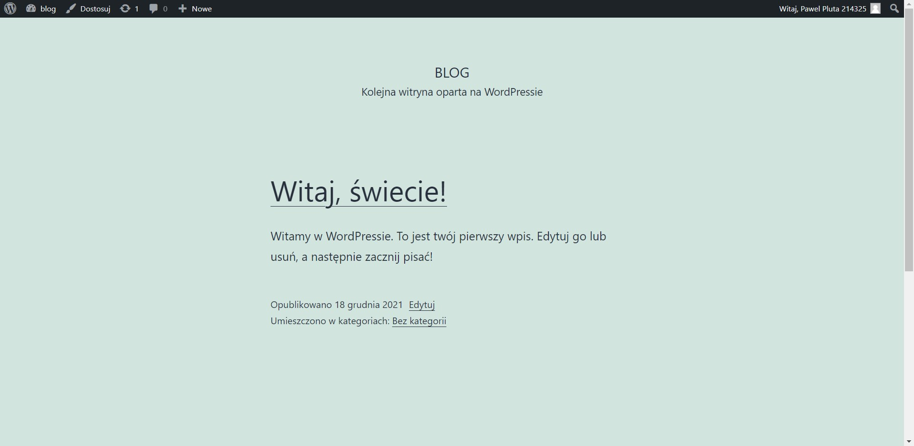

# install wordpress

## steps

- install https server
- install EPEL
- install php repo
- install php packages
- download and extract wordpress
- copy vhost config
- copy wordpress config
- copy database service repo
- install database service packages
- reload database service
- create user and database
- assign privilages
- reload https server

## result

